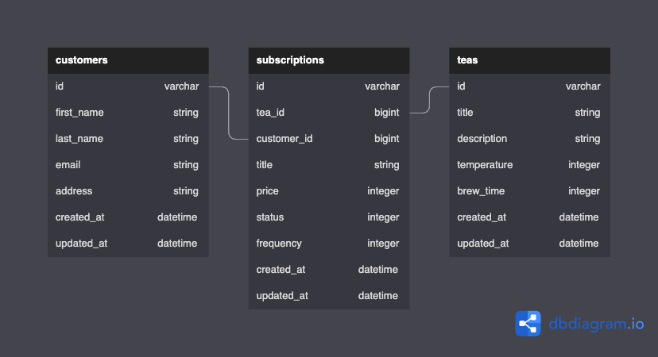

# README: Tea Subscription Service
## **Table of Contents**
- [MVP](#mvp-description)
- [Schema](#schema)
- [Requirements](#requirements)
- [Local Setup](#local-setup)
- [Available Endpoints](#available-endpoints)

## **MVP description [MVP](./docs/MVP.md)**

## **Schema**


## **Requirements**


- gem jsonapi-serializer

## **Local Setup**
- `fork` then `git clone` this repository
- `cd tea_subsription_service` into the root directory
- `bundle install` to install dependencies
- `rails db:{create,migrate,seed}`
- `rails s` to start your server on `localhost:3000`

## **Available Endpoints**
### GET: /api/v1/customers/1/subscriptions
- expected JSON response
```
{
    "data": {
        "type": "subscriptions",
        "attributes": [
            {
                "id": 1,
                "tea_id": 1,
                "customer_id": 1,
                "title": "John sub",
                "price": 4,
                "status": "cancelled",
                "frequency": "weekly",
                "created_at": "2022-08-02T20:32:36.534Z",
                "updated_at": "2022-08-02T20:32:36.534Z"
            },
            {
                "id": 2,
                "tea_id": 2,
                "customer_id": 1,
                "title": "John sub",
                "price": 4,
                "status": "active",
                "frequency": "monthly",
                "created_at": "2022-08-02T20:32:36.535Z",
                "updated_at": "2022-08-02T20:32:36.535Z"
            }
        ]
    }
}
```

### POST: /api/v1/customers/1/subscriptions
- JSON body
```
{

        "tea" : "Earl Grey",
        "price" : 500,
        "frequency" : "monthly",
        "status" : "active"
}
```
- expected JSON response
```
{
    "data": {
        "type": "subscriptions",
        "attributes": {
            "id": 14,
            "title": "John's Earl Grey",
            "price": 500,
            "frequency": "monthly",
            "status": "active"
        }
    }
}
```

### PATCH: /api/v1/customers/1/subscriptions/1
- expected JSON response
```
{
    "data": {
        "type": "subscriptions",
        "attributes": {
            "id": 1,
            "title": "John sub",
            "price": 4,
            "frequency": "weekly",
            "status": "cancelled"
        }
    }
}
```
